# Crowded_analysis
This is a tutorial of spectator behaviour analysis due to the COVID-19 crisis. The spectator behaviour analysis includes: detection spectator, tracking each spectator and giving them unique ID number, social distancing calculation, spectator movement distance, speed and density.


## Requirement

Development Environment: I strongly recommend to use the Anaconda virtual environment.

- OpenCV
- SKlearn
- Pillow
- Numpy 
- Tensorflow-gpu 1.15.2 (recommended) or Tensorflow-CPU 1.15.2 (for desktop running only)
- CUDA 10.0 

  If your local machine does not have GPU (CUDA needed), please use the **Tensorflow-CPU** to replace it. 

___

The detection and tracking is based on the **YOLOV3** and **Deep SORT**. 

- YOLOV3: detect objects on each of the video frames;
- Deep SORT: track those objects over different frames.

*This repository contains code for Simple Online and Realtime Tracking with a Deep Association Metric (Deep SORT). We extend the original SORT algorithm to integrate appearance information based on a deep appearance descriptor. See the [arXiv preprint](https://arxiv.org/abs/1703.07402) for more information.*


## Quick Start 

__1.Requirement__

```python
pip install -r requirements.txt 
```

__2. Download the YOLO v3 weights to your computer.__

 [[yolov3.weights]](https://pjreddie.com/media/files/yolov3.weights)

And place it in `./model_data/`

__3. Convert the Darknet YOLO model to a Keras model:__

``` 
$ python convert.py model_data/yolov3.cfg model_data/yolov3.weights model_data/yolo.h5
```

__4. Select the Region of Interest:__

```
$ python observe_and_view_transform.py 
```

When running the script, it will follow the guidance to input the video file name and the image size you want to get. In practice, the image size is commonly 800 ppx.  

__5. Run the YOLO_DEEP_SORT:__

```
$ python main.py -c [CLASS NAME] -i [INPUT VIDEO PATH]

$ python main.py -c person -i ./video/testvideo.avi
```


## Tutorials for beginner

### 1. install the virtual environment 

1. Download the Anaconda virtual environment installing package from the  [[link]](https://repo.anaconda.com/archive/Anaconda3-2021.05-Windows-x86_64.exe).

2. Install the package into your system disk. 

3. After installing the anaconda environment, the first step is to create a new virtual environment, using the prompt. 

   ```shell
   conda create -n "your favior name" python=3.7
   ```

   or if you install the virtual environment, you can use the `conda info --env` to check the details of your environment. 

   After installing your virtual environment, the `conda activate "your favior name"` to activate your virtual environment and then we need to install some necessary packages in this environment. 

4. After activating the environment, it needs to install the necessary packages for running the program. The necessary packages are shown in the `requirement.txt`. 


### 2. set-up your IDE 

We choose the `Pycharm` integrated development tool to run the program. The `Pycharm` can be downloaded from the [link](https://www.jetbrains.com/pycharm/download/download-thanks.html?platform=windows&code=PCC). There are two version and we choose the community version for free.  In the settings, we need to choose the virtual environment which we have finished in the first step. 

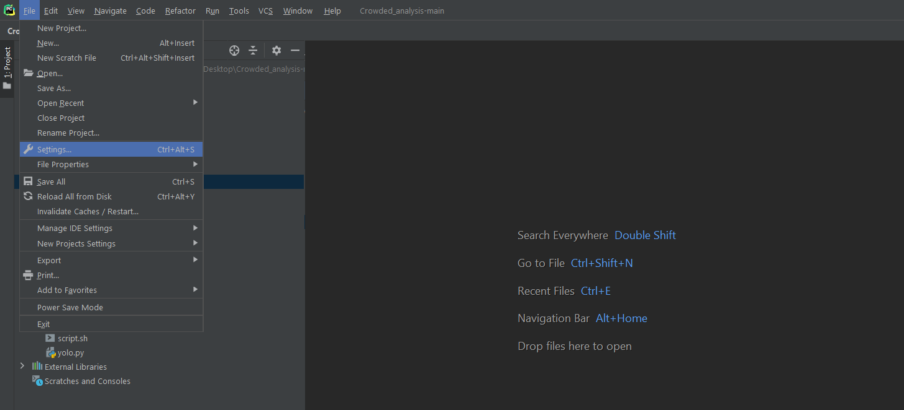


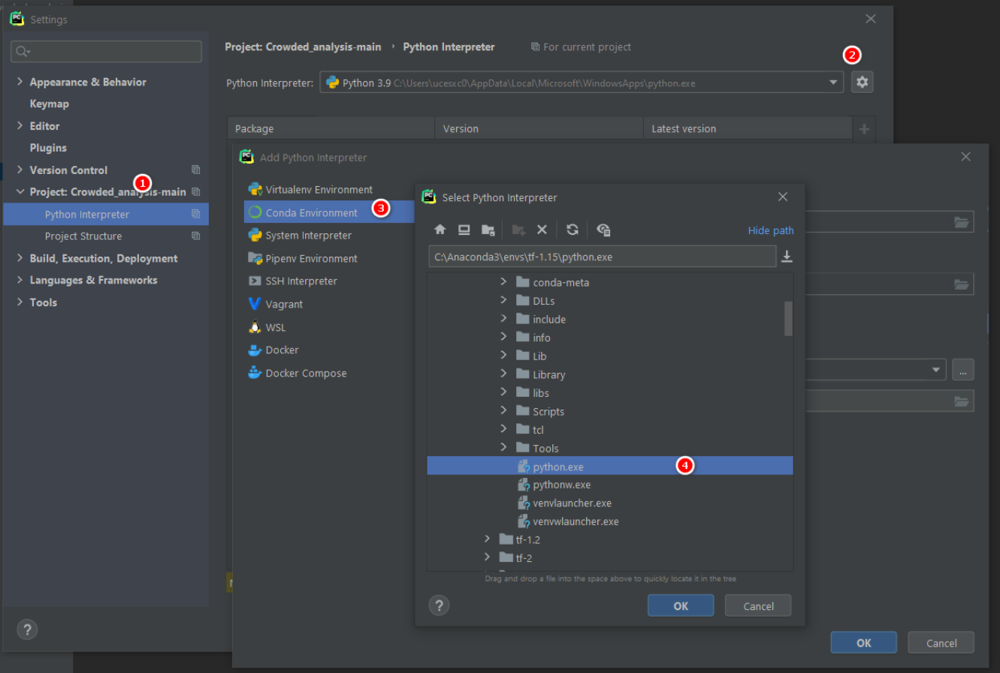


After inputting all the necessary packages, the environment setup is finished. 

### 3. Running the code 

The code file tree is:

```
├─2d_3d_transformation
├─camera_calibrate
│  ├─calibration_image
│  │  ├─Carbao_cup
│  │  │  ├─205
│  │  │  ├─248
│  │  │  ├─A108
│  │  │  └─H108
│  │  ├─FA_final
│  │  │  ├─108
│  │  │  ├─113
│  │  │  ├─205L
│  │  │  └─501
│  │  └─O2
│  │      ├─L11
│  │      ├─L12
│  │      └─L2
│  ├─cam2world_coordinate
│  │  ├─Carbao_cup_coordinate_cam2world
│  │  ├─FA_final_cam2_world
│  │  └─O2_cam2_world
│  ├─camera_calibration_params
│  │  ├─Carbao_params
│  │  ├─FA_final_params
│  │  └─O2_params
│  ├─frame
│  ├─reference_img
│  └─video_for_calibrate
│      ├─Carbao_cup_calibration
│      ├─FA_final_calibration
│      └─O2_calibration
├─conf
│  ├─Carbao_cup_observation
│  ├─FA_final_observation
│  └─O2_observation
├─deep_sort
│  └─__pycache__
├─img
│  ├─FA_final_observation_area
│  ├─O2_observation_area
│  └─observation_area
├─model_data
├─output
│  ├─Carbao_cup_results
│  ├─FA_Final
│  └─O2
├─tools
│  └─__pycache__
├─video
│  ├─Carbao_Cup_Final
│  ├─FA_Final
│  │  ├─level_108
│  │  ├─level_113
│  │  ├─level_205
│  │  └─level_501
│  └─O2
│      ├─level11
│      ├─level12
│      └─level2
└─yolo3
```


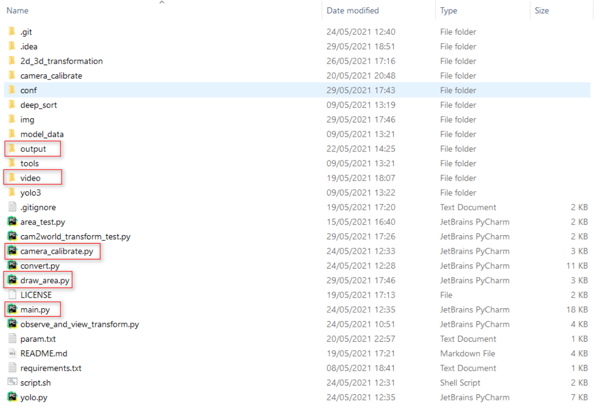

After you clone the repository from the Github [link](https://github.com/rechardchen123/Crowded_analysis.git). 

1. make three file folders `output` to store the final results, the `model_data` for downloading the `YOLO v3` training weights ([YOLO v3](https://pjreddie.com/media/files/yolov3.weights)) and the `video` for analysis data. 

2. The analysis flow is shown in figure:

   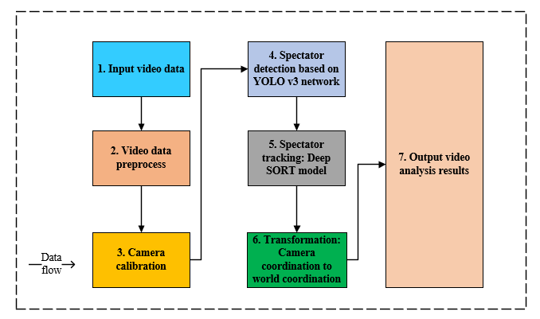

   The analysis programming is consisted by 7 modules.

3. Convert the downloaded weights into the Keras compatible format. 

   ```shell
   python convert.py model_data/yolov3.cfg model_data/yolov3.weights model_data/yolo.h5
   ```

4. `camera calibration`: the camera calibration is to get the Homograph matrix.  Before that, the camera parameters: intrinsic matrix, rotation matrix, translation matrix are needed, as shown in figure. 

   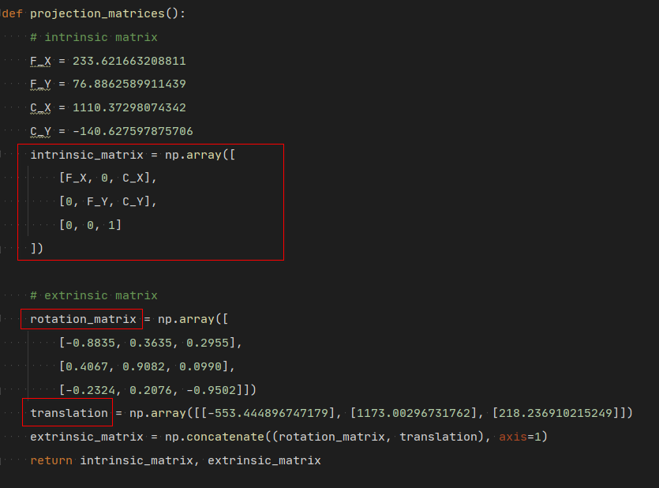

   The folder `2d_3d_transformation` has provided to get these parameters. However, we have tested many times and the results are not satisfied our requirements. I have strongly recommend to use the `camera calibrator` provided by Matlab tool box to get these parameters. 

   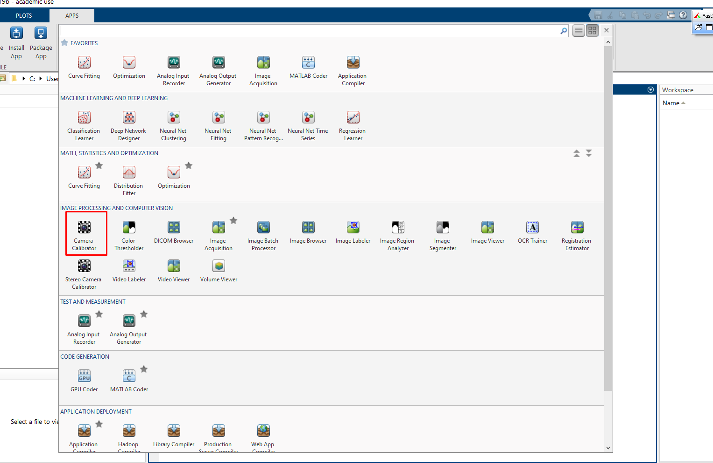

   The `Camera Calibrator` needs at least 2 different angle cheeseboard images to output the intrinsic and extrinsic matrix. We use the `Carbao Cup Final ` in level `108` as an example to illustrate the workflow of the calibration. The calibration video is framed (the function is called `video_to_frame.py` in subfolder of `camera_calibrate` )and randomly select 34 images for calibration. 

   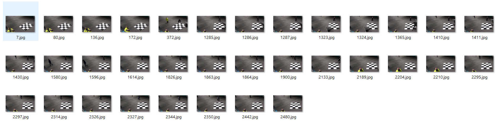

   And then, the selected images are processed by the calibrator.  Inputting the size of cheeseboard size of each square. In our cases, each square cheeseboard size is `50` millimetres and then press the `calibrate` to get parameters, which the output result shows in figure as follows. 

   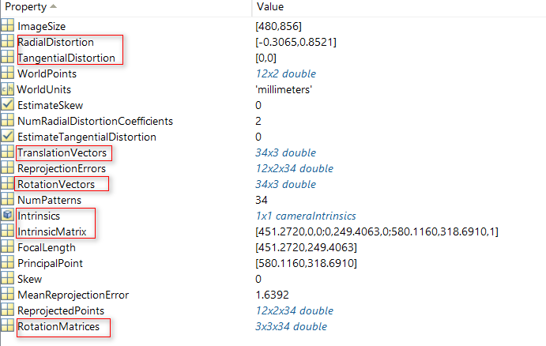

   The `radial distortion` and `tangential distortion` are used to adjust the distortion. The `translation vectors` and `rotation vectors`  are used to get the extrinsic matrix and the `IntrinsicMatrix` is shown in image. 

   After getting these parameters, we can get the Homograph matrix using the function as above illustrated. The output of the Homograph matrix is a $3 \times 3$ matrix for helping transformation between camera coordinate and real-world coordinate. 

5. Select the Region of Interest (ROI) area for analysis: when I start to analyse these videos, the spectator which is in the corner of the images has a server distortion due to lack of depth information to use. In order to reduce the factor and increase the robustness of the algorithm, we choose a region which is in the centre of the image. The function `observe_and_view_transform.py` has conducted it and the output of the ROI is shown in figure:

   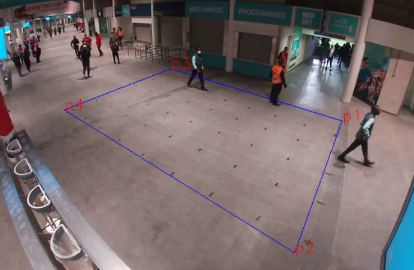

   We randomly choose four points to locate the ROI area. 

6. After making preparation for the Homograph matrix and selecting the ROI area, the next is to feed the video into the analysis pipeline to detection and tracking each person. The detection is conducted by the `YOLO v3` network which can make a real-time detection for each person. The weight of the `YOLO v3` is used from the `Tensorflow` provided and the weights have already been converted into the `Keras` version in step 3. The detection function in the programming is `yolo.py` and the subfolder `yolo3`. These functions is based on the `Tensorflow` and `Keras` development framework, if you need to conduct or change some of the modules, you can refer to the development documents from [Tensorflow](https://www.tensorflow.org/tutorials/quickstart/beginner) and [Keras](https://keras.io/). The tracking will output each person’s real-time position in the video and get a bounding box for each spectator. Due to different spectator’s height and different bounding box size, we get each spectator’s centre coordination ($x,y$ coordinate in each frame) to indicate each spectator’s position for the tracking using. 

7. The tracking in this programming is to track each person in each frame and get a stable moving routes for each spectator. The tracking is based on the paper called “Simple online and real-time tracking with a deep association metric” which is abbreviated into `Deep SORT`. The tracking algorithm currently is a hard problem for the image and video analysis area and the accuracy cannot reach a very high level. In our cases, we focus on the spectators, but sometimes, the spectator movement is not a rigid body movement model, it will has some deformation, which is quite different from the vehicle tracking. Therefore, we only realise around 90% accuracy. For some cases, such as two spectators walking side by side or one person blending down may lose the tracking. The tracking will get each person’s movement speed, movement speed and some necessary information, which is shown in the figure. The details of the calculating each person’s movement distance or speed will be explained detailly in the programming, please refer some of the coding. 

   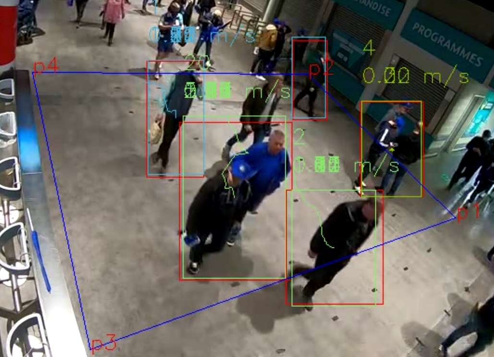

   Finally, the detection output also output these data:

   - detection coordinate for each spectator (the output format is `*.txt`).
   - detection and tracking videos after analysing by the programming (`*.avi`).
   - each spectator’s ID, image coordinate, real-world coordinate, speed etc. (`*.csv`).

   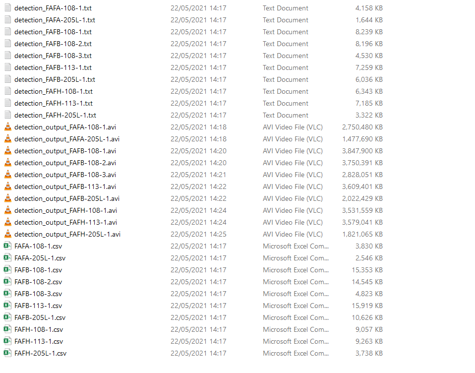

## Tutorials for running the code in the HPC platform 

Due to the PC’s processing limitation, the detection and tracking have a very slow speed in your PC and the best option is to run the code using the UCL HPC platform which provides large through input and output capability. The best option is to run the code using the GPU in the HPC. Here, I will give some necessary information and example to deploy your code in the UCL HPC to help referring for your further works. 

### 1. Prepare your job script. 

For running the code in UCL HPC, you need firstly to prepare your running script which is used to apply the number of CPUs, GPUs and the running times. Here, the example for the running script is:

```shell
#!/bin/bash -l

#1. Request half hour of wallclock time (format hours:minutes:second).
#$ -l h_rt=25:00:0

#2. Request 8 gigabyte of RAM (must be an integer)
#$ -l mem=16G

#3. Request 15 gigabyte of TMPDIR space (default is 10 GB)
#$ -l tmpfs=15G

#4. Request 16 cores.
#$ -pe smp 16

#5. set up the job array.
#$ -t 1-10

#6. Set the name of the job.
#$ -N O2_analysis

#7. Set the working directory to somewhere in your scratch space.  This is
# a necessary step with the upgraded software stack as compute nodes cannot
# write to $HOME.
# Replace "<your_UCL_id>" with your UCL user ID :)
#$ -wd /home/ucesxc0/Scratch/output/crowded_spectator_analysis/O2/

#8. Parse parameter file to get variavles.
number=$SGE_TASK_ID
paramfile=/home/ucesxc0/Scratch/output/crowded_spectator_analysis/O2/param.txt
index="`sed -n ${number}p $paramfile | awk '{print $1}'`"
variable1="`sed -n ${number}p $paramfile | awk '{print $2}'`"

#9. activate the virtualenv
conda activate tf-2

#10.  load the cuda module
module unload compilers
module load compilers/gnu/4.9.2
#module load cuda/10.1.243/gnu-4.9.2
#module load cudnn/7.6.5.32/cuda-10.1

#11. Run job
./main.py -c person -i $variable1

conda deactivate
```

In order to analyse ten videos simultaneously, we also write a job sequence `param.txt` which contains the name of each video. 

```
0001 CA-248
0002 CB-248
0003 CH-248
```

 ### 2. create a working space 

In order to organise your code and output, the best way is to build a working space for your job. The HPC needs some necessary shell command line to do it. 

```shell
mkdir "your favior name"
cd "your favior name"
```

And then, using the `Winscp` or `Filezila` software to upload your code and original video data to the destination address in the HPC. 

### 3. running the code

After making a preparation for your code, then browser into the working space. Using the command line to submit your code to the HPC schedule server. `qsub *.sh` is to submit your job. `qstat` is to check the status of your work, `qdel + job no.` is to delete your job. 

```shell
qsub *.sh
qstat 
qdel
```

After finishing running your code, you can browser into the working space to check the data. The HPC can provide 100 times speed than your PC. It can save lots of time for your job. 


## Reference

YOLOv3 :

```
@article{yolov3,
title={YOLOv3: An Incremental Improvement},
author={Redmon, Joseph and Farhadi, Ali},
journal = {arXiv},
year={2018}
}
```

Deep_SORT :

```
@inproceedings{Wojke2017simple,
title={Simple Online and Realtime Tracking with a Deep Association Metric},
author={Wojke, Nicolai and Bewley, Alex and Paulus, Dietrich},
booktitle={2017 IEEE International Conference on Image Processing (ICIP)},
year={2017},
pages={3645--3649},
organization={IEEE},
doi={10.1109/ICIP.2017.8296962}
}

@inproceedings{Wojke2018deep,
title={Deep Cosine Metric Learning for Person Re-identification},
author={Wojke, Nicolai and Bewley, Alex},
booktitle={2018 IEEE Winter Conference on Applications of Computer Vision (WACV)},
year={2018},
pages={748--756},
organization={IEEE},
doi={10.1109/WACV.2018.00087}
}
```

